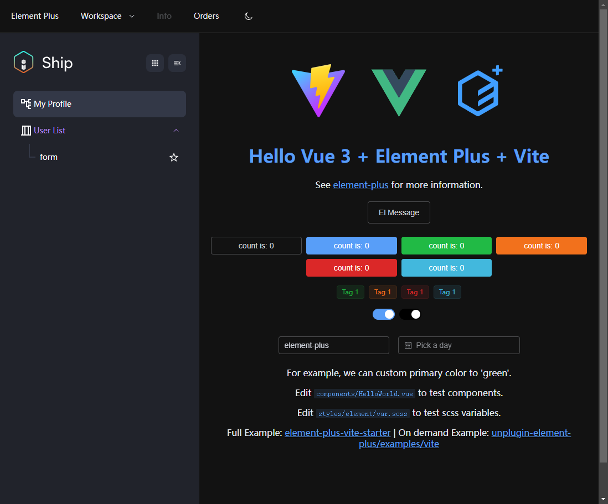
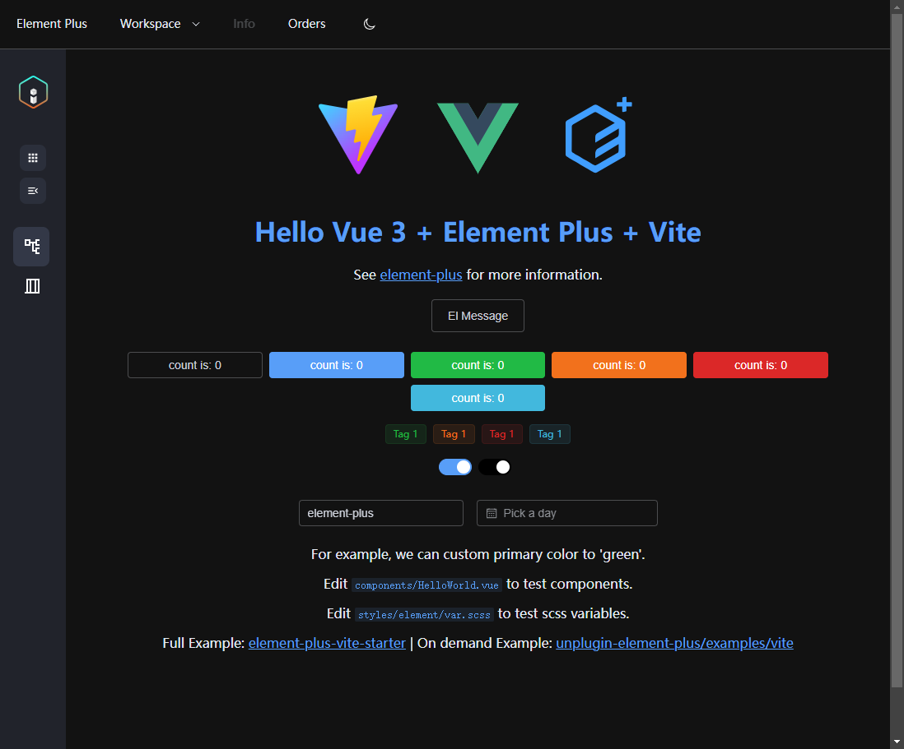

# 标准IStandardSidebar
目前只支持dark mode


## 何时使用
按需加载
```ts
import { StandardSidebar as IStandardSidebar } from "unisc-item-ui";
import "unisc-item-ui/es/standard-sidebar/style/index.css";
```

## 代码演示


<demo src="./demos/basic.vue"></demo>

## 效果



## 属性


| 属性       | 说明                         | 类型     | 默认值  |
| ---------- | ---------------------------- | -------- | ------- |
| data      | 菜单数据                  | `Array` | `[]` |
| application    | Application数据                  | `Array` | `[]`   |
| defaultApplicationActive | 默认激活哪一个application | `String`  | `1` |
| collapse | 是否展开折叠     | `Boolean`  | `false` |
| width | sidebar宽度 | `String`  | `360px` |

## 事件
| 事件名       | 说明                   | 类型       | 默认值                   |
| ------------ | ---------------------- | ---------- | ------------------------ |
| more | 点击Application触发的回调     | `Function` | `(value: Boolean) => void` |
| collapse  | 点击折叠按钮触发的回调 | `Function` | `(value: Boolean) => void` |


